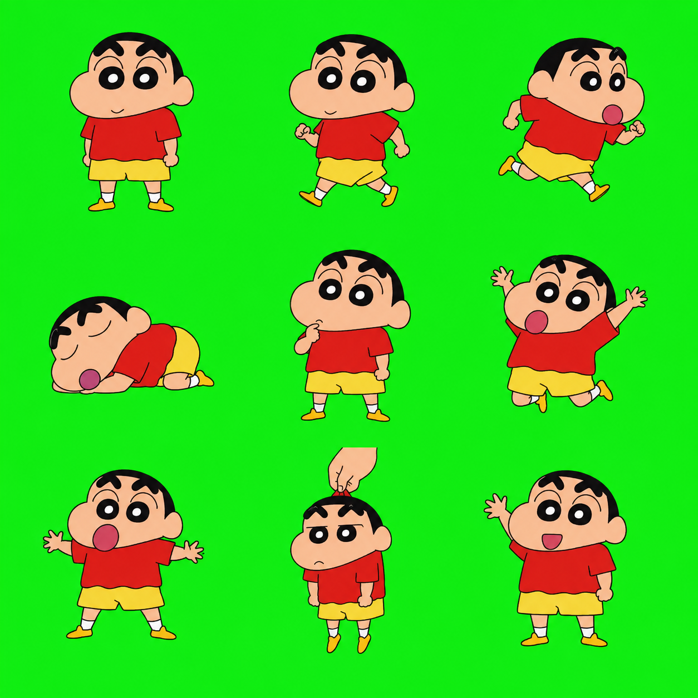

# dsh-desktop-pet 项目说明

## 项目定位

`dsh-desktop-pet` 是一个面向 DeepSeek Harness（DSH）Web 客户端的桌面宠物插件。插件通过 DSH 的 Host Bundle 和 Web Client 扩展点加载，不修改 DSH 核心代码。

## 目录结构

- `src/index.ts`：Host 侧插件入口和 Bundle 生命周期声明。
- `src/client.js`：Web 客户端实现。
- `lib/`：由 TypeScript 和客户端构建脚本生成的发布产物。
- `assets/characters/`：角色包、精灵图和拆分后的状态图片。
- `scripts/split-sprite-sheet.mjs`：按固定九宫格坐标拆分精灵图。
- `cordis.patch.yml`：把插件加入 DSH Bundle 的补丁配置。

## 默认角色

项目内置蜡笔小新风格的角色包，包含闲置、行走、奔跑、睡眠、思考、庆祝、惊讶、拖拽和说话九种状态。状态图片位于 `assets/characters/shinchan/sprites/`，构建时会内嵌到 `lib/client.js`。

项目同时内置一套原创橘猫角色包，资源位于 `assets/characters/orange-cat/`。在桌面宠物上点击右键并选择“切换宠物”，即可在小新和橘猫之间循环切换；选择结果会保存在浏览器本地。

下面的精灵图展示了桌面宠物的完整状态样式，顺序与角色包规范一致（从左到右、从上到下依次为闲置、行走、奔跑；睡眠、思考、庆祝；惊讶、拖拽、说话）。



## 本地开发

```sh
pnpm install
pnpm typecheck
pnpm build
```

在本地 DSH Web profile 中安装：

```sh
dsh plugin --profile web add link:$PWD
```

重启 `dsh web` 并刷新 Web 客户端后，桌面宠物会显示在右下角。

## 角色包规范

角色包通过 `manifest.json` 描述。支持的状态键为：`idle`、`walk`、`run`、`sleep`、`think`、`celebrate`、`surprised`、`drag` 和 `talk`。缺失状态会回退到 `idle`，再回退到内置图形。

精灵图按 3×3 网格排列，顺序为：

```text
idle, walk, run
sleep, think, celebrate
surprised, drag, talk
```

## 运行时切换角色

客户端可以派发 `dsh-desktop-pet:set-character` 自定义事件切换角色包。事件详情支持 `name`、`size` 和 `assets` 字段，`assets` 的值可以是 Web 可访问的图片地址。

## 许可证

项目代码采用 MIT License。角色图片为项目内生成的演示资源，使用时请遵守相关 IP 和素材授权要求。
